# Guidance for Streamlining Data Access with Jira Service Management and Amazon DataZone

## Table of Contents 

1. [Overview](#overview)
    - [Cost](#cost)
2. [Prerequisites](#prerequisites)
    - [Operating System](#operating-system)
    - [General Configurations](#general-configurations)
    - [Jira Prerequisites](#jira-prerequisites) 
3. [Deployment Steps](#deployment-steps)
4. [Deployment Validation](#deployment-validation)
5. [Running the Guidance](#running-the-guidance)
6. [Next Steps](#next-steps)
7. [Cleanup](#cleanup)

***Optional***
8. [Notices](#notices)
9. [Authors](#authors)

## [Overview](#overview)

AWS Customers are actively building their data management platform on top of Amazon DataZone, realising how they can achieve effective governance of their data lakes and data warehouses.
Amazon DataZone offers a subscription workflow that allows to abstract handling the underlying permissions when sharing access to data. As described in the figure below “Publish & Subscribe workflow”, data producers can use the Amazon DataZone portal to request access for a project to a data asset published in the data catalog. Data consumers can then accept or reject this request. If accepted, all the members of the requesting project will be able to access the requested data asset and use it to create business value by building new use cases. Amazon DataZone takes care of granting the required IAM and AWS Lake Formation permissions (in case of data lakes), and the required data shares permissions (in case of data warehouse) to the requesting project.

Typically, Some customers have already established standardised approval workflows using issue tracking systems such as Atlassian Jira. These customers want to use **issues** (some call it “tickets”) to track permission requests. Therefore, they want to integrate DataZone subscriptions with their issue tracking systems for the following major reasons:
.

1. Enhance efficiency by consolidating the request management process within a single, familiar interface. Therefore, eliminate the need to navigate to the Amazon DataZone portal separately.
2. Be able to reassign Jira issues to other data access approvers.
3. Enhance collaboration and Streamline the data access by automatically receiving email notifications from Jira on status changes of issues and Facilitate better communication through commenting on the issues.

The purpose of this guidance is to help customers streamline data access permissions by integrating with external workflows like the Atlassian Jira Service Management solution. This guidance can be extended to other management service solutions.

This Guidance is built on top of the AWS Cloud Development Kit (CDK) and is designed to be an add-on for Amazon DataZone that is easy to deploy, extend, and customise for any customer needs. It is a fully automated solution that covers the entire subscription lifecycle.

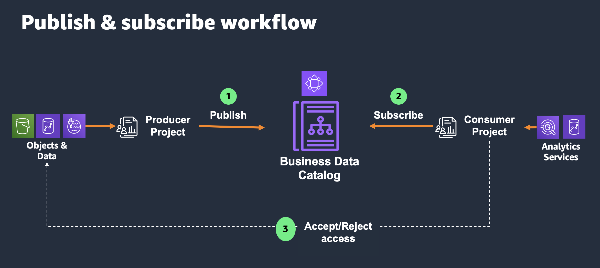
With the integration described in this guidance, you enable automated creation of issues as displayed in the image below
in a Atlassian Jira Project. Moving the issue to *Accepted* or *Rejected* will propagate this decision to Amazon DataZone, therefore granting access or rejecting the subscription request.

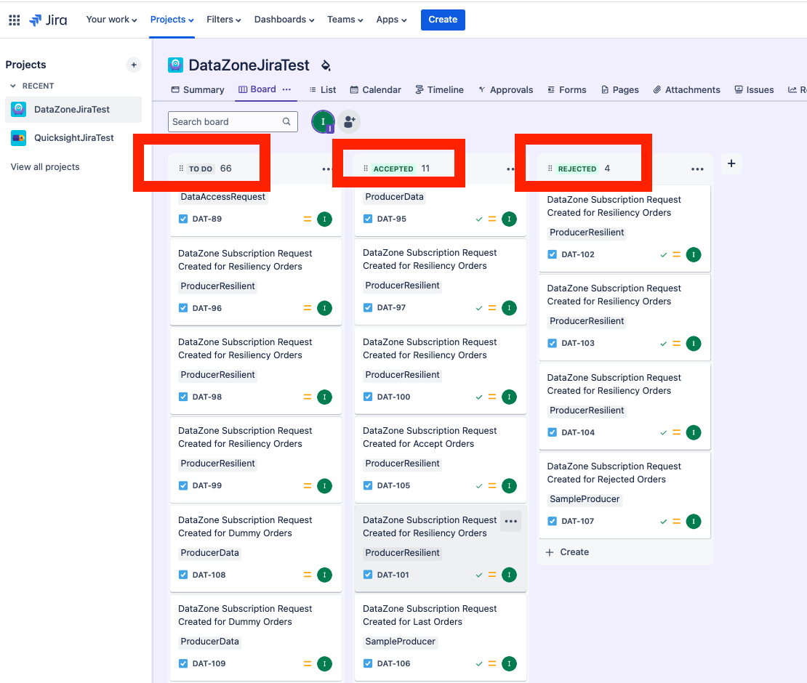

The following figure shows the data contained in the Jira issue:

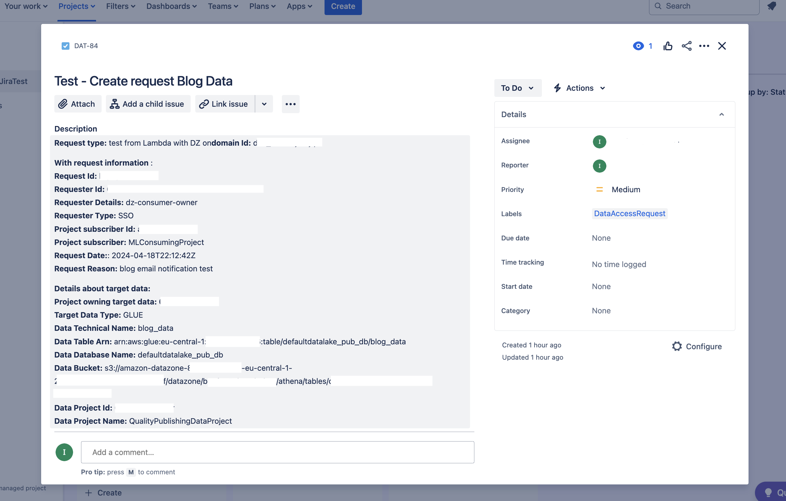


The following figure shows the guidance reference architecture, illustrating the subscription workflow from data access request on Amazon DataZone portal to the update of its status through Jira.

Some components of the architecture are pre-requisites and not deployed by CDK. To use the integration between Amazon DataZone and Atlassian Jira management system, you need to:

1. Create an Amazon DataZone domain.
2. Create a set of consumer and producer projects for which you want to apply the workflow.
3. Create an Atlassian Jira Project.
4. Store Jira credentials in AWS Secrets Manager.

The workflow steps are:

1. A consumer searches for a data asset in **Amazon DataZone** portal and submits a subscription request to access a data asset.
2. **Amazon DataZone** emits an event** **that is captured through an event rule in **Amazon EventBridge**, which triggers the execution of a target **AWS Step function**.
3. An **AWS Step function** adds tasks to an **Amazon Simple Queue Service (Amazon SQS)** queue.
4. The **Create Get Issue AWS Lambda** function polls a task from the SQS queue, parses the event and performs Amazon DataZone API calls for content for the Jira issue.
5. The **Create Get Issue AWS Lambda** function gets Jira credentials from **AWS Secrets Manager** and creates the issue in the Jira project.
6. Producers change the status of the issue in Jira project board to status *Accepted* or status *Rejected*.
7. The **AWS step function** triggers the *Create Get Issue ***AWS Lambda** function to poll regularly the status of the issue and checks for a status change. When the status is set to *Accepted* or *Rejected*, it triggers the execution of the *DataZone Subscription Update* **AWS Lambda function**.
8. The DataZone Subscription Update **AWS Lambda** Function assumes an **AWS Identity and Access Management (AWS IAM)** role that is a member of an **Amazon DataZone** producer project of that publishes the requested data asset.
9. The DataZone Subscription Update **AWS Lambda** function calls the **Amazon DataZone API** to update the status of the subscription request to Approved or Rejected.
10. If the status of the issue in Jira was changed to *Accept*, the consumer accesses the data.


### [Cost](#cost)
You are responsible for the cost of the AWS services used while running this solution. As of this revision, the cost for running this solution with the default settings in the US East (N. Virginia) is approximately **$16.33 per month**. These costs are based on the resources shown in the sample cost table.
We recommend creating a budget through AWS Cost Explorer to help manage costs. Prices are subject to change. For full details, see the pricing webpage for each AWS service used in this solution.

### Sample Cost Table

The following table provides a sample cost breakdown for deploying this solution with the default parameters in the US East (N. Virginia) Region for one month.
The estimate presented below assumes the following usage pattern:

* **Number of users**: 20,000
* **Number of data assets**: 7,000
* **Number of requests for data asset access per user per month**: 3
* **Number of AWS Step Functions executions per month**: 60,000
* **Number of steps per execution**: 6
* **Average execution time of AWS Lambda functions**: 2 second
* **Number of AWS Lambda invocations per month**: 120,000 (60,000 for each function)
* **Memory allocated to each Lambda function**: 128 MB

Each customer has its own specific usage pattern driven by the number of users, data assets, and the frequency of access requests.

The following table provides a sample cost breakdown for deploying this Guidance with the default parameters in the US East (N. Virginia) Region for one month.


We recommend creating a [Budget](https://docs.aws.amazon.com/cost-management/latest/userguide/budgets-managing-costs.html) through [AWS Cost Explorer](https://aws.amazon.com/aws-cost-management/aws-cost-explorer/) to help manage costs. Prices are subject to change. For full details, refer to the pricing webpage for each AWS service used in this Guidance._


## [Prerequisites](#prerequisites)
### [Operating System](#operating-system)
These deployment instructions are optimized to best work on macOS. Deployment in another OS may require additional steps.

### [General Configurations](#general-configurations)


* An [AWS account](https://signin.aws.amazon.com/signin?redirect_uri=https%3A%2F%2Fportal.aws.amazon.com%2Fbilling%2Fsignup%2Fresume&client_id=signup) (with an existing Amazon DataZone domain available)
* Bash/ZSH terminal
* AWS credentials and profiles for each environment under ~/.aws/config [here](https://docs.aws.amazon.com/cli/latest/userguide/cli-configure-files.html)
* You must export `AWS_PROFILE` and `AWS_REGION` containing the AWS Account credentials where you will deploy Amazon DataZone to. This is necessary to be present before performing any infrastructure deployment via AWS CDK below.
* Python version >= 3.12
* AWS SDK for Python >= 1.34.87
* Node >= v18.18.*
* NPM >= v10.2.*
* It is a prerequisite to create the following DataZone resources before you can use this guidance:
    * Create an Amazon DataZone Domain - make sure to configure the ID of this domain in `DataZoneConfig.ts` when deploying this guidance. Optionally if you encrypt the domain with a CMK, please also configure the KMS Key ID in the same file.
    * Create an Amazon DataZone Project.
    * Create an Amazon DataZone environment from where you want to publish data assets.
    * Publish at least one Data Asset.
* Atlassian Jira project with 3 statuses: To Do, Accepted, Rejected

Assuming that you have cloned the repository, run the following command to install the required dependencies:
```
npm install
```
### Bootstrap governance and governed accounts

In order to bootstrap  the account, you need to have an AWS CLI profile for your chosen account already in place. For more details, review the [AWS documentation](https://docs.aws.amazon.com/cli/latest/userguide/cli-configure-files.html) for configuration and credential file settings.
Run the following AWS CDK command to allocate base AWS CDK resources (known as bootstrapping).. Replace `<AWS_PROFILE>`and `<AWS_REGION>` with the corresponding profile name, account id, and region that maps to the account you are going to bootstrap.

```
npm run cdk bootstrap -- --region ${AWS_REGION} --profile ${AWS_PROFILE}
```

If you have not created an AWS_PROFILE, export the following environment variables and replace the placeholders with the right values

```
export AWS_ACCESS_KEY_ID=<AWS_ACCESS_KEY_ID_PLACEHOLDER>
export AWS_SECRET_ACCESS_KEY=<AWS_SECRET_ACCESS_KEY_PLACEHOLDERS>
export AWS_SESSION_TOKEN=<TOKEN_PLACEHOLDER>
export AWS_REGION=<AWS_REGION>
```

This will allow you to run the command without the extra arguments as follows
```
npm run cdk bootstrap
```

As part of the bootstrapping process, AWS CDK will create a set of IAM roles that will be used when deploying resources in your accounts. These can be accessed through the AWS console or using the AWS CLI.


### Supported Regions 
This Guidance requires Amazon DataZone, which is currently not available in all AWS Regions. See [AWS Regional Services List](http://aws.amazon.com/about-aws/global-infrastructure/regional-product-services/) for current availabilities.

With GA, Amazon DataZone domains can be provisioned in the following AWS Regions: US East (Ohio), US East (N. Virginia), US West (Oregon), Asia Pacific (Singapore), Asia Pacific (Sydney), Asia Pacific (Tokyo), Canada (Central), Europe (Frankfurt), Europe (Ireland), Europe (Stockholm), and South America (São Paulo).


### [Jira Prerequisites](#jira-prerequisites) 

1. A Jira account.
2. A Jira Project within the account you want to use to manage issues with status *To Do*, *Accepted* and *Rejected*.
3. A user with the appropriate permissions to manage issues.


Here is an example where Jira is on-premise and the project id is DATAZN

```
https://abc.xyz.com/jira/projects/DATAZN
```

### Configure Jira authentication

Authentication mechanisms vary depending on how your organisation is set up to use Jira. If you use a cloud instance of Jira, then a user + token is normally sufficient to authenticate. The current solution has been tested with a Jira cloud instance for deployment and requires a user and a token to be configured in a secret in AWS secret manager deployed by the solution.

If your organisation has its own Jira server then you might additionally need a client certificate. You can find in the code a placeholder in a comment where you can specify you client certificate (in jira_workflow.py , search for *certificate authentication )*
If you use a Jira instance running on premise. Here are the 2 steps required to configure access in such cases.

1. **Client Certificate** - A client certificate was required to allow communication between the AWS account and the customers on-premise Jira service.
    1. A PKCS12 client certificate was generated by the customer and had a lifetime validity of 365 days.
    2. The certificate is stored in AWS secret manager as a secret e.g. XYZ_JIRA_ClientCertificate
    3. The secret value was stored with the following format

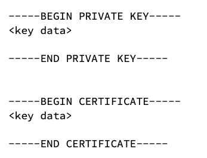

2. **Jira Credentials**
    1. **Jira user** - Create a user within the above project with the appropriate permissions to be able to create and update issues. [See this page to understand Jira roles and permissions](https://www.atlassian.com/software/jira/guides/permissions/overview#what-are-project-roles).
    2. **API Token** - Create an API token for the user using the Jira console.
    3. Store the Jira user and token as key value pairs in the AWS secret manager as a secret e.g. JiraCredentials.

### Test access to Jira

Once you have configured Jira and the credentials, you should test if access works as expected. Here is an example using the serverInfo endpoint. Ensure that you replace the url with your project url.

```
curl --request GET \ 
    --url 'https://<<your jira>>/rest/api/3/serverInfo' \ 
    --user 'email@example.com:<api_token>' \ 
    --header 'Accept: application/json'
```

You will find more examples [here](https://developer.atlassian.com/cloud/jira/platform/rest/v3/api-group-server-info/#api-group-server-info).


## [Deployment Steps](#deployment-steps)

This stack is a CloudFormation (cfn) stack that deploys the subscription workflow.
Follow these steps to deploy the stack in your account:
### 1. Get the solutions' code 
* Clone the guidance repository :
  `git clone https://github.com/aws-solutions-library-samples/guidance-for-streamlining-data-access-permissions-with-amazon-datazone-and-jira-ticketing-system`
* Go to the directory of the cloned repository
  `cd guidance-for-streamlining-data-access-permissions-with-amazon-datazone-and-jira-ticketing-system`
### 2. Configure required inputs
* Run the `scripts/prepare.sh` to provide the DZ_DOMAIN_ID which will then be replaced in the following file `config/DataZoneConfig.ts. `This domain Id is referenced to provide the permissions to perform api calls on the specified Amazon DataZone domain.

**Example:**
`scripts/prepare.sh dzd_3abcdef0972oi3`

* If your Amazon DataZone domain is encrypted with a KMS customer managed key, specify the ARN of the your key in `config/DataZoneConfig.ts` for argument `DZ_ENCRYPTION_KEY_ARN`. Otherwise, keep the value of `DZ_ENCRYPTION_KEY_ARN` as `null `
* Specify input parameters regarding your Atlassian Jira project in `config/SubscriptionConfig.ts`
    * In `SUBSCRIPTION_DEFAULT_APPROVER_ID`, Specify the Id of your Jira Project Lead with administrator role. You can find it by following the steps in the accepted answers of this link https://community.atlassian.com/t5/Jira-questions/How-to-get-the-user-ID-of-a-user-not-me/qaq-p/2185274
    * In `WORKFLOW_TYPE,` specify `JIRA`
    * In `JIRA_PROJECT_KEY`, specify your project key. It can be found in the URL you use to access Jira
    * In `JIRA_DOMAIN,` specify the host name of the domain of your Jira project. [For example `somedomain.atlassian.net`](https://inasdzpoc.atlassian.net/).
    * **Example:**
      You have the following link to access your Jira project:
      [https://somedomain.atlassian.net/jira/core/projects/PROJECT/board](https://inasdzpoc.atlassian.net/jira/core/projects/DAT/board)
      In this example, `JIRA_DOMAIN` corresponds to [somedomain.atlassian.net](https://inasdzpoc.atlassian.net/) and `JIRA_PROJECT_KEY` corresponds to `PROJECT`.
* Run the following command to deploy AWS CDK app, replacing `<AWS_PROFILE>` and `<AWS_REGION>`with the AWS CLI profile name mapping to your account:

```
npm run cdk deploy -- --all --region ${AWS_REGION} --profile ${AWS_PROFILE}
```

You will be able to see the progress of the deployment in your terminal and [AWS CloudFormation console](https://console.aws.amazon.com/cloudformation/home?) of your account.


## [Deployment Validation](#deployment-validation)

Open [CloudFormation console](https://console.aws.amazon.com/cloudformation/home?) and verify the status of the templates with the names `ExternalWorkflowIntegDataZoneAccessStack` , `ExternalWorkflowIntegDataZoneSubscriptionStack.`

## [Running the Guidance](#running-the-guidance)

In order to have your end to end workflow working after perfoming the deployment, follow these steps:

1. Add Jira Admin credentials to Secret in AWS Secret Manager

    * create an api token from https://id.atlassian.com/manage-profile/security/api-tokens ( follow the steps in https://support.atlassian.com/atlassian-account/docs/manage-api-tokens-for-your-atlassian-account/)
    * In the AWS account where you deployed the solution, locate secret with name: `/JIRA/subscription-workflow/credentials`

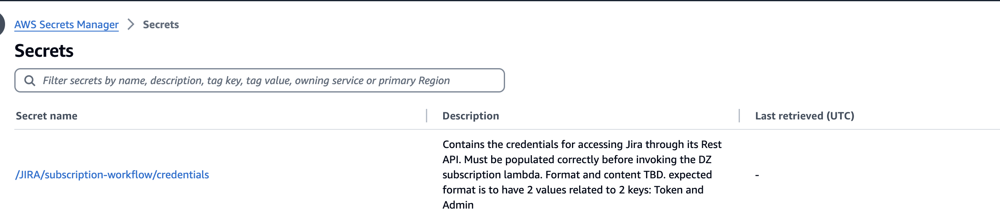

  * Click on Retrieve secret value

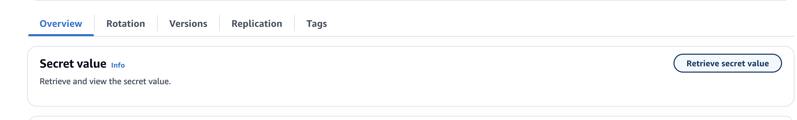

  * Click on Edit, you will get the following error. Don’t worry, this is an expected behaviour since access to read the secret has been restricted to only the AWS Lambda function creating and getting the issues.

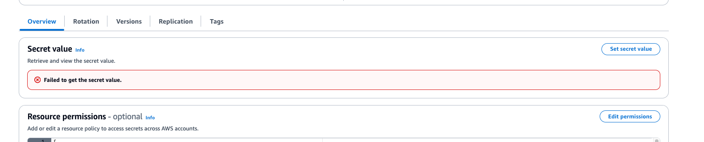

  * Click on set secret and add Token with value as the value generated in the first step
  * Add an Admin as the email of an administrators of your project

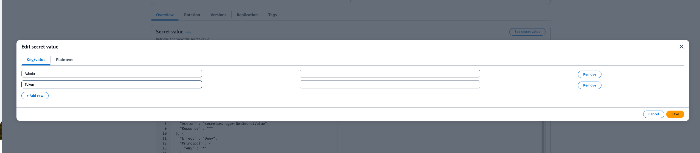

1. Add IAM role to the projects where you want to enable the automation presented in this guidance

    * Go to Amazon IAM
        * To be able to add IAM roles as members of Amazon DataZone projects, Add permissions to **AmazonDataZoneDomainExecution** role **** as described in  https://docs.aws.amazon.com/datazone/latest/userguide/add-members-to-project.html#:~:text=To%20add%20IAM%20principals%20as,%3AGetUser%20and%20iam%3AGetRole%20

    ```
    {
       "Version": "2012-10-17",
       "Statement": [
          {
             "Effect": "Allow",
             "Action": [
                "iam:GetUser",
                "iam:GetRole"
             ],
             "Resource": "*"
          }
       ]
    }
    ```

    *  find a role named [dzLambdaSubscriptionManagerRole](https://us-east-1.console.aws.amazon.com/iam/home?region=eu-central-1#/roles/details/dzLambdaSubscriptionManagerRole), Copy the arn of this IAM role
    *  Go to you Amazon DataZone project where you want to enable the automation of this solution, go to members section, click on add a member. You will get the following pop up, paste the copied IAM Arn and click on enter. Then add it as a member of the projects with Contributor role


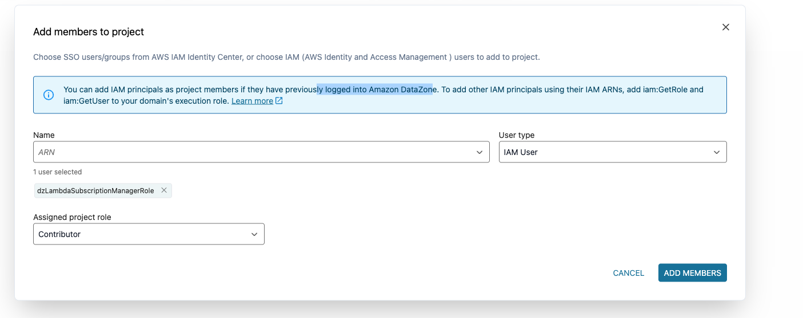
**Example:**
If you want to test the workflow end to end

## Create a sample producer project and sample data asset

1. Go to you Amazon DataZone domain specified in your configuration before deploying the solution. Create an Amazon DataZone sample producer project with name: **SampleProducer**

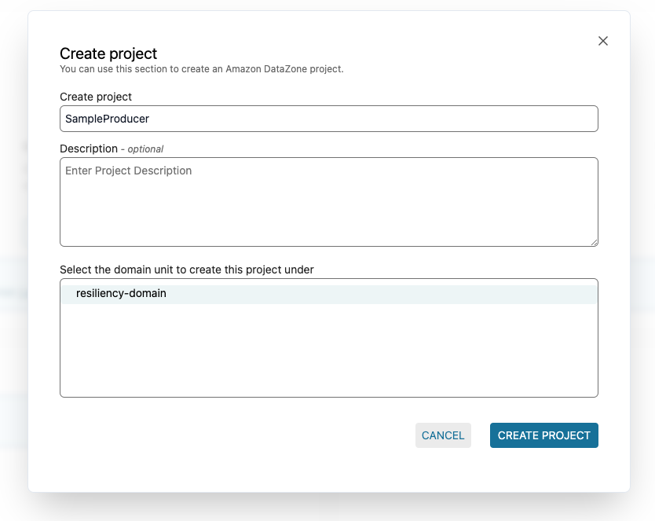

1. Create an environment with name: **DefaultAccount** and select Environment profile as **DatalakeProfile**, then click on create environment

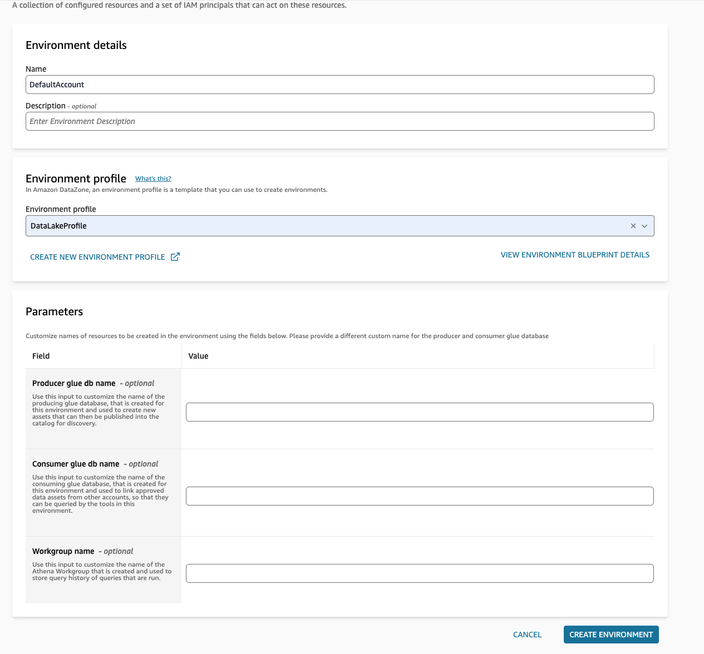

1. Create sample dataset
    1. Open the query editor by clicking on **Query data** in analytics tools, make sure the right workgroup is selected. The workgroup name is by default the environment name
    2. copy the following sql query to create dummy date

```
CREATE TABLE sample_orders AS
SELECT 146776932 AS ord_num, 23 AS sales_qty_sld, 23.4 AS wholesale_cost, 45.0 as lst_pr, 43.0 as sell_pr, 2.0 as disnt, 12 as ship_mode,13 as warehouse_id, 23 as item_id, 34 as ctlg_page, 232 as ship_cust_id, 4556 as bill_cust_id
UNION ALL SELECT 46776931, 24, 24.4, 46, 44, 1, 14, 15, 24, 35, 222, 4551
UNION ALL SELECT 46777394, 42, 43.4, 60, 50, 10, 30, 20, 27, 43, 241, 4565
UNION ALL SELECT 46777831, 33, 40.4, 51, 46, 15, 16, 26, 33, 40, 234, 4563
UNION ALL SELECT 46779160, 29, 26.4, 50, 61, 8, 31, 15, 36, 40, 242, 4562
UNION ALL SELECT 46778595, 43, 28.4, 49, 47, 7, 28, 22, 27, 43, 224, 4555
UNION ALL SELECT 46779482, 34, 33.4, 64, 44, 10, 17, 27, 43, 52, 222, 4556
UNION ALL SELECT 46779650, 39, 37.4, 51, 62, 13, 31, 25, 31, 52, 224, 4551
UNION ALL SELECT 46780524, 33, 40.4, 60, 53, 18, 32, 31, 31, 39, 232, 4563
UNION ALL SELECT 46780634, 39, 35.4, 46, 44, 16, 33, 19, 31, 52, 242, 4557
UNION ALL SELECT 46781887, 24, 30.4, 54, 62, 13, 18, 29, 24, 52, 223, 4561
```

2. Go to the datasources of your project and run the data source related to the previously created environment. The `sample_orders` is added to the inventory of your project, click on **Publish asset** to make it visible on the Amazon DataZone catalog

## Create a sample consumer project

1. Follow steps 1 and 2 to create a  consumer project with name: **SampleConsumer** and create an environment for that project.
2. Look for your data asset using key words on the search bar and click on subscribe request reason: **sample test of subscription workflow**
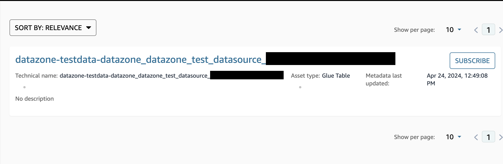
3. create a subscription request. Let's consider the sample_orders created previously
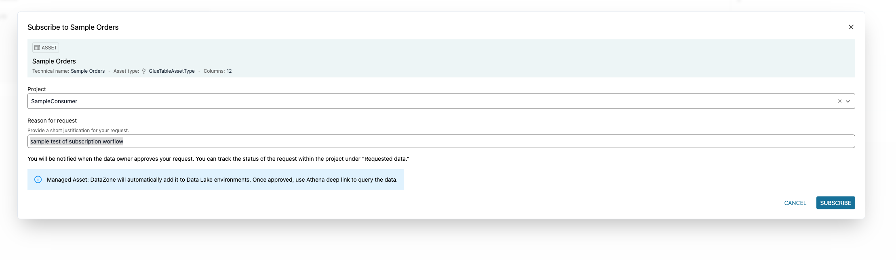
4. Trigger Workflow in DataZone:
- After submitting the subscription request, the workflow will be triggered automatically.
5. Then Open your Jira project, You will be able to see a new Jira ticket created on the Jira board related to your subscription request. You should see a task similar to the one depicted in the following figure
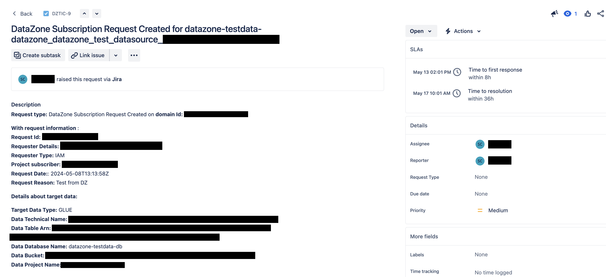
6. Move it to Accepted (or Rejected)
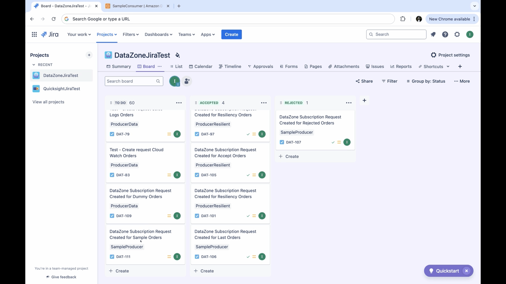
7. Wait for Status Update:
- Wait for at least 60 seconds, as this is the default waiting time of the step function before checking the status of the ticket.
You will be able too see the issue the subscription request accepted (or rejected) on your Amazon DataZone portal under Subscribed Data section.

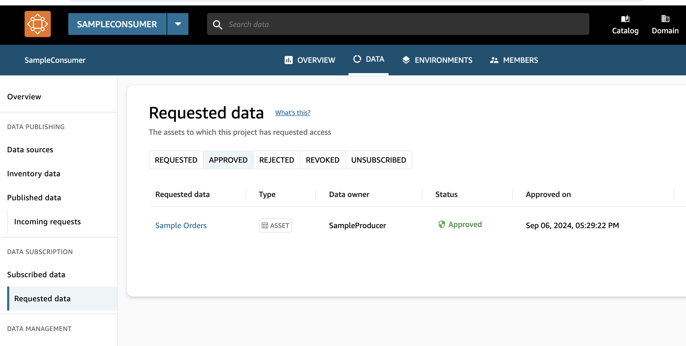

# Update the Guidance

To update the guidance, you just follow the same steps for deployment, leveraging CDK’s change set functionality. Deploy it from your favourite CI/CD tooling. Always remember to review the change set produced to ensure no unintentional changes or downtimes are caused. Perform deployments first in your test environments or accounts to ensure the change is not breaking existing functionality or features. Continue to deploy to your production environment only after having verified your changes.


1. Subscribe to a New Dataset in DataZone:

- Open your DataZone project.
- Subscribe to a new dataset following the procedure shown in Figure 1.


2. Trigger Workflow in DataZone:

- After submitting the subscription request, the workflow will be triggered automatically.

3. Check Jira Project for Task:

- Open your Jira project.
- You should see a task similar to the one depicted in Figure 2.


4. Update Jira Ticket:

- Move the Jira ticket accordingly, marking it as Approved or Rejected based on your evaluation.

5. Wait for Status Update:

- Wait for at least 60 seconds, as this is the default waiting time of the step function before checking the status of the ticket.


## [Next Steps](#next-steps)


Thanks to the external workflow class hierarchy, this solution offers some level of extensibility if you want to connect to similar external workflow systems that support the concept of issue creation and retrieval via API. 
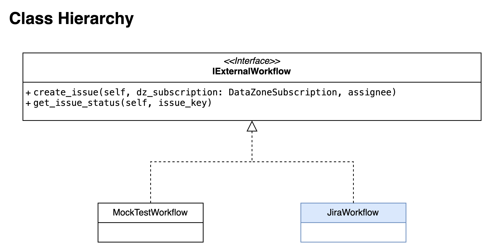

For this you need to:

* Add a new implementation of `IExternalWorkflow` to implement communication with the new external workflow system.
    * Class attributes: Create attributes for all the input parameters needed to communicate with the external workflow
    * Implement create_issue and get_issue functions respecting the functions signatures in `IExternalWorkflow`

Below you see the `MockTestWorkflow` class as an example. You can find it in the source code of the guidance:

```
import logging

from external_workflow import IExternalWorkflow
from data_zone_subscription import DataZoneSubscription

logger = logging.getLogger()
logger.setLevel(logging.INFO)


class MockTestWorkflow(IExternalWorkflow):
    '''A mock test external workflow doing nothing but returning fixed values. Just for testing purposes.'''
    def __init__(self, accept: bool) -> None:
        self.accept = accept

    def create_issue(self, dz_subscription: DataZoneSubscription, assignee):
        logger.info(f"Mock Test Workflow: create_issue for assignee {assignee}")

        return 'IssueId1234567'


    def get_issue_status(self, issue_key):
        logger.info(f"Mock Test Workflow: get_issue_status for issue_key {issue_key}")

        return ('Accepted' if self.accept else 'Rejected', 'assignee')
```

* Add a new `WORKFLOW_TYPE` condition for the new external workflow system in `create_workflow` function in `common.py`
    * Read the input parameters needed by the workflow as environment variables
    * Instantiate the new class

As an example look at the statements for Mock workflow:

```
def create_workflow(workflow_type_string):
    if workflow_type_string == "MOCK_ACCEPT":
        return MockTestWorkflow(True)
    elif workflow_type_string ==  "MOCK_REJECT":
        return MockTestWorkflow(False)
    elif workflow_type_string == "JIRA":
       # ... continued
```

* If extra environment variables are needed because the new workflow needs more parameters than the ones already present in `SubscriptionConfig.ts`
    * add en entry to `SubscriptionConfig.ts`
    * Pass that entry as an environment variable to the dataZone_create_get_issue lambda function in `DataZoneSubscriptionStack.ts`


## [Cleanup](#cleanup)

### Uninstall using AWS Management Console

* Sign in to the [CloudFormation console](https://console.aws.amazon.com/cloudformation/home).
* On the **Stacks** page, go through the following stacks in the suggested order, and choose **Delete** for each one of them. It is recommended to wait for deletion of each stack before moving to the next:
    * `DataZoneSubscriptionAutomationRoleStack`
    * `DataZoneSubscriptionStack`

### Uninstall using the AWS CDK CLI

Execute the following command to destroy CDK app, replacing `<AWS_REGION>` and `<AWS_PROFILE>` with the AWS CLI profile name mapping to your governed account:
`npm run cdk destroy -- --all —region ${AWS_REGION} --profile ${AWS_PROFILE}`

Even though the AWS CDK CLI will give you live updates on the destroy process, you can always follow along in the CloudFormation console.

**Additional considerations**

For any feedback, questions, or suggestions, please use the issues tab under this repo
**Useful commands**

- `npm run build`           compile typescript to js
- `npm run watch`           watch for changes and compile
- `npm run test`            perform the jest unit tests
- `npm run cdk deploy`      deploy this stack to your default AWS account/region
- `npm run cdk diff`        compare deployed stack with current state
- `npm run cdk synth`       emits the synthesized CloudFormation template

## [Notices](#notices)

Customers are responsible for making their own independent assessment of
the information in this document. This document: (a) is for
informational purposes only, (b) represents AWS current product
offerings and practices, which are subject to change without notice, and
(c) does not create any commitments or assurances from AWS and its
affiliates, suppliers or licensors. AWS products or services are
provided "as is" without warranties, representations, or conditions of
any kind, whether express or implied. AWS responsibilities and
liabilities to its customers are controlled by AWS agreements, and this
document is not part of, nor does it modify, any agreement between AWS
and its customers.

## [Authors](#authors)

- Inas Kaci
- Sindi Cali
- Jens Ebert
- Sanjay Kashalkar
- Gezim Musliaj
- Guido Pomidoro
- Leonardo Gomez
- Deepika Suresh
